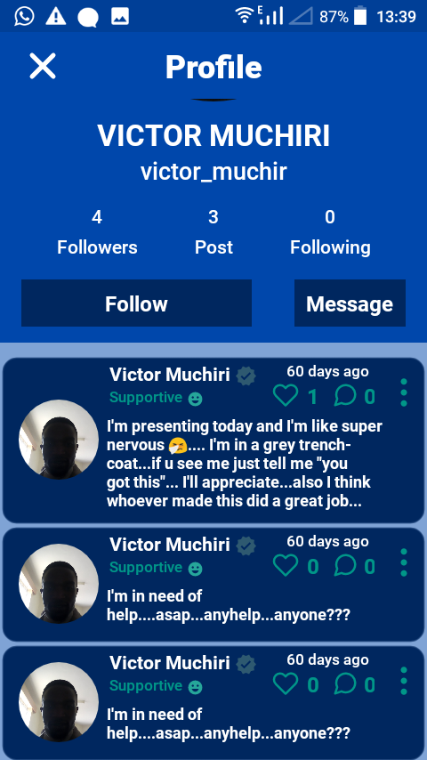

# Android Mental Health Application

 (Screenshot_20230522-133915.png)

## Overview
This Android application is developed as a final year project to address mental health concerns. The application provides a comprehensive set of features to support users in managing their mental well-being.

>> There's a "PleaseREADME.txt" file 
>> in the main folder on how to build

- The gradle Version used in ""gradle-6.7.1""
- The jdk version is in the ReadMe.txt

## Features
- Real-time Chatting: The app allows users to connect with others and engage in real-time chat conversations, providing a platform for support and communication.
- Firebase Integration: Firebase backend services are utilized for user authentication, data storage, and real-time messaging.
- User Registration and Login: Users can create an account, log in, and manage their personal profile.
- Mental Health Resources: The application offers access to a range of mental health resources such as articles, tips, and guides to assist users in learning and practicing self-care.
- Mood Tracking: Users can track their mood over time using the built-in mood tracker, enabling them to monitor their emotional well-being.
- Reminder Notifications: The app allows users to set reminders for self-care activities, medication schedules, or therapy sessions.
- Personal Journaling: Users can maintain a private journal within the application to record their thoughts, feelings, and experiences.

## Technologies Used
- Java: The primary programming language used for Android app development.
- Firebase: The backend services provided by Firebase are integrated into the application for user authentication, real-time messaging, and data storage.
- Android Studio: The official integrated development environment (IDE) for Android app development.

## Getting Started
To get started with the Android Mental Health Application, follow these steps:

1. Clone the repository: `git clone https://github.com/your-username/mental-health-app.git`
2. Open the project in Android Studio.
3. Connect the app to your Firebase project by following the Firebase integration guide.
4. Build and run the application on an Android device or emulator.
5. Explore the various features and functionalities of the app.

## Contributions
Contributions to the Android Mental Health Application are welcome! If you have any suggestions, bug reports, or feature requests, please open an issue or submit a pull request.
